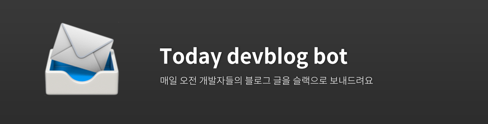
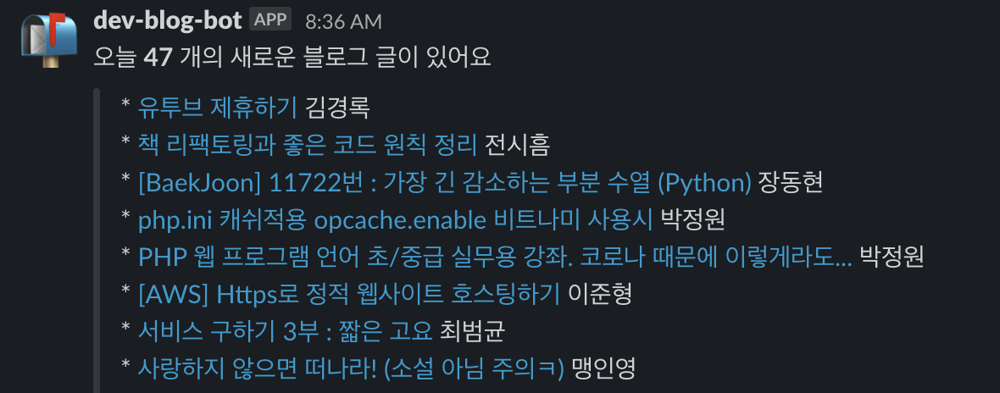

# today-devblog-bot   

📨 매일 오전 8시 개발자님들의 블로그 글을 슬랙 채널로 편하게 보내드려요 

`Github Actions` 를 이용한 토이프로젝트 입니다.  
`Repository`를 `fork` 하신 후 아래와 같은 방법을 사용하시면 슬랙을 통해 매일 오전 메세지를 받으실 수 있습니다. 

# 사용법

- 레포지토리를 `fork` 합니다.
- `Settings` - `Secrets` - `Add a new secret` 메뉴로 들어갑니다
- `WEBHOOKS` 라는 이름으로 슬랙의 `Incomming Webhook` 주소를 입력하여 저장합니다.
- `src/config.json` 파일에서 원하는 태그만 남겨놓고 저장합니다 (default: 전체).
- 매일 아침 8시 새로운 블로그글들이 슬랙으로 전송됩니다. 🎉

# 레퍼런스
- https://github.com/sarojaba/awesome-devblog
